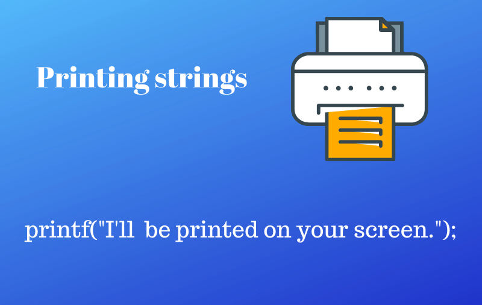

# printf

### Description

------------

The printf function sends formatted output to stdout.
A custom _printf() for learning purposes was developed by cohort #15 student Ali Mohamed.
_printf() function format string is a character string, beginning and ending in its initial shift state, if any. 
These arguments are placed using the percentage '%' operator

------------

#### Resources

------------

Secrets of printfby Don colton
https://www.cypress.com/file/54761/download

------------

#### Authorized functions and macros

------------

write (man 2 write)
malloc (man 3 malloc)
free (man 3 free)
va_start (man 3 va_start)
va_end (man 3 va_end)
va_copy (man 3 va_copy)
va_arg (man 3 va_arg)

------------

#### Compilation

------------

The code must be compiled this way:

**$ gcc -Wall -Werror -Wextra -pedantic *.c**

As a consequence, be careful not to push any c file containing a main function in the root directory of your project (you could have a test folder containing all your tests files including main functions)

The main files will include your main header file (holberton.h): **#include main.h**

------------

#### Use & Examples

------------

**Prototype:** int _printf(const char *format, ...);
**Use - General:** _printf("format string", var1, var2, ...);

**Examples:**
 - Basic String: _printf("%s Holberton", "Hello");`
	 - Output: Hello Holberton

- Print integers: _printf("This is an array element: arr[%d]:%c", 32, arr[32]);`
	- Output: This is an array element arr[32]:A

Many other specifiers and flags were added and by combinig those the _printf() function generate a different ouput. The following list are the specifiers and flags allowed.

------------

#### Use & Examples

------------

###### Specifiers

Specifier                |Output                        |Examples |
|----------------|-------------------------------|-----------------------------|
| `c` | Character | y |
| `d` or `i` | Signed integer | 1024, -1024 |
| `s` | String of characters | Hello Holberton |
| `r` | Reversed string of characters | dlroW 
------------

#### Files contained in this repository

------------

|Name                |Information                        |Relevant Files                         |
|----------------|-------------------------------|-----------------------------|
|`main.h` | Header file with the data type struct, standard libraries and custom prototypes.| `*.c compilation` |
|`printf.c`|Main printf function file. Calls other functions.|`printf_(name of var).c file` |
|`handle_percent.c`|Contains percentage print function.|`None` |
|`handle_int.c` | Contains integer function. | `None` | 
`handle_decimal.c` | contains decimal function. | `None` |
`handle_char.c` | Custom function for char data type. | `None`
|`handle_sting.c` | Function that calls string type variable. | `None` |
`handle-rev_string.c` | Returns a string in reverse. | `None` |
`cout.c` | Custom putchar function. | `None` |

------------

#### Tasks required for this project

------------

0. ###### I am not going anywhere. You can print that wherever you want to. I'm here and I am a Spur for life1.  I am not going anywhere. You can print that wherever you want to. I'm here and I am a Spur for life. 
Write a function that produces output according to a format.
Handle the following conversion specifiers:
- c
- s
- %

1. ###### Education is when you read the fine print. Experience is what you get if you dont
Handle the following conversion specifiers:
- d
- i

14. ###### Print is the sharpest and the strongest weapon of our party
Handle the following custom conversion specifier:
 - r : prints the reversed string

### Author &copy;

- Ali Mohamed
